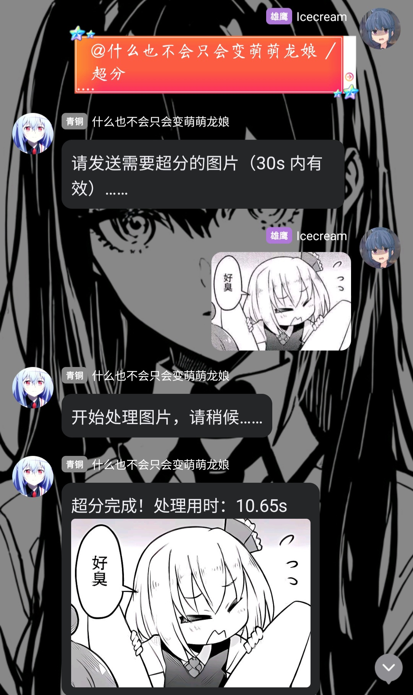

# astrbot-plugin-super-resolution

为 astrbot 做的超分插件

安装:

在 astrbot 插件市场中直接安装或者将本仓库 clone 到"AstrBot\data\plugins"中

**注意：目前 basicsr 在 python3.13 安装有问题，直接`pip install basicsr`是不行的，因此除了`pip install -r requirements.txt` 之外**

**还需要从我修改的仓库安装 basicsr，`pip install https://github.com/Ayachi2225/BasicSR_fix_set_up.git`，在 astrbot 插件市场安装的也要！**（uv 或者 conda 安装的自行修改 pip 命令即可）

使用例：输入：/超分 ，等待机器人回复，然后发送图片，等待一段时间即可

注意事项：

1.超分比较吃设备，默认使用 GPU，如果显卡比较差或者没有显卡可能很慢。设计的就是处理些动漫小人图片，如果你想处理比较大的图片请自行修改 Max size 项。

2.超分倍率也可以自行设置，默认放大 2 倍，建议不要太大，太大了我也不知道会发生什么。

3.理论上是所有平台适用的，但也说不准，我只测试了通过napcat的qq服务

~~抄袭~~借鉴了[IORNY](https://github.com/ElainaFanBoy/IRONY.git)里的超分插件~~据说他也是抄的，但我忘记抄的谁了，谁感兴趣自己去找吧~~

# Supports

- [AstrBot Repo](https://github.com/AstrBotDevs/AstrBot)
- [AstrBot Plugin Development Docs (Chinese)](https://docs.astrbot.app/dev/star/plugin-new.html)
- [AstrBot Plugin Development Docs (English)](https://docs.astrbot.app/en/dev/star/plugin-new.html)
